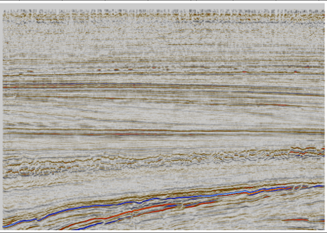
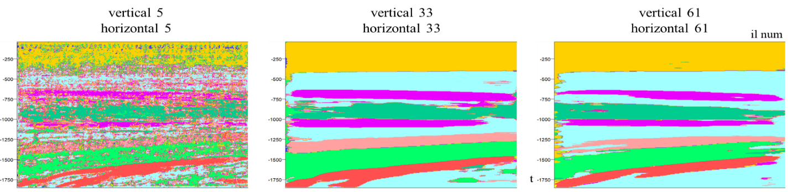
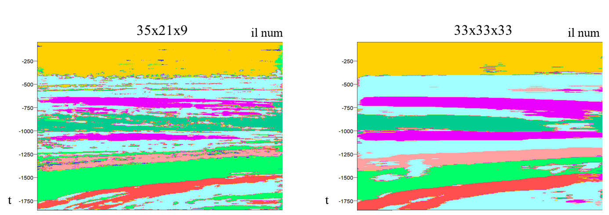

### The application of 3D CNN with a fully connected head for seismic segmentation task.

The original implementation is here: https://github.com/bolgebrygg/MalenoV. Was improved by Yang I., Chu W., the details are here: https://cs230.stanford.edu/projects_spring_2018/reports/8291004.pdf.

This tool is essentially a relatively simple convolutional network with a fully connected head based on 3D convolutional layers. Training and prediction is performed point-by-point. The feature of this tool is that around each of the points considered a small 3D volume of data around it is taken into account (subcube). Each training example becomes a small 3D volume of data.

This implementation is focused on treating a subcube size as a hyperparameter and making sense of it.

#### The entire process is run from the main.py file, and all the main settings are defined there. The detailed description of parameters is given in the comments in the file itself.

To run a model with a particular set of parameters set **n_param_samples** to **1** and make  **cube_incr_x**, **cube_incr_y**, **cube_incr_z** to be lists containing a single value.

Training outputs are the following: txt files with accuracy, train and prediction runtimes, batch and validation accuracy and loss values, subcube sizes; images of a batch accuracy/loss history plot, confusion matrix, predicted section; predicted section in segy format; trained model (*.h5 file); a folder with ROC curve plots.

**main.py** – both training and prediction processes are run from this file, all the major settings are defined there  
**train.py** – contains a function that runs a training loop and saves results  
**utils.py** – contains all the miscellaneous functions to read segy and interpretation files, save results 
**predict.py** – contains a function that runs prediction and saves results

The open source F3 seismic dataset was used for experiments. The section that was used as test data is shown below:

Here are some prediction examples obtained with different subcube sizes:

Overall, the more data is supplied at each location, the smoother and less detailed the result is (similar to the effect the number of samples used for averaging has).

The key insight is that the optimal subcube size may be approximated by the maximum range of spatial correlation between pairs of points in each of the X, Y, Z directions (variogram ranges). In the picture below the result obtained with a subcube calculated as described above and the one obtained with a "defaut" subcube are compared. From a geological perspective, the one on the left has much more interesting details that could be potentially related to real geological features in the subsurface.

